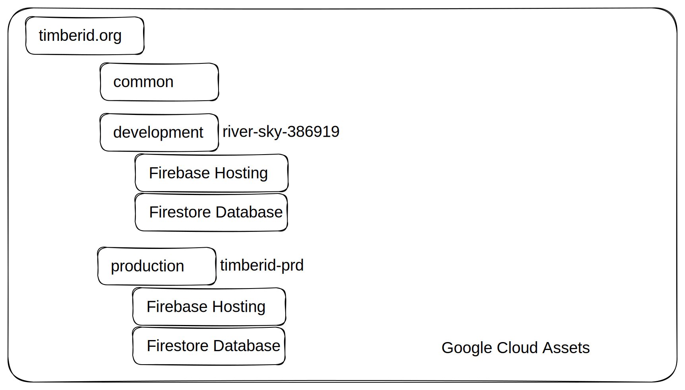

# ♒ Client

## FrontEnd Detail Design

The Client consists of the Front End, which is written in Typescript and hosted using [Firebase Hosting](https://firebase.google.com/docs/hosting). This is a Firebase web application and directly reads and writes to the underlying backend [Firestore](https://firebase.google.com/docs/firestore).


The Front End is open sourced at [the tnc-br github organization](https://github.com/tnc-br/ddf-sample-tracking/tree/main).


The client contains the following functionality



### Login, Signup and Password Reset

TimberID uses built in Firebase functionality to sign up with Google or email/password.

[login.tsx](https://github.com/tnc-br/ddf-sample-tracking/blob/main/sample\_tracking/app/login/login.tsx#L30C1-L42C15)

```typescript
    function attemptSignIn() {
        setErrorText({email: '', password: ''})
        setSubmitIsLoading(true);
        const email = (document.getElementById('email') as HTMLInputElement).value;
        const password = (document.getElementById('password') as HTMLInputElement).value;
        console.log('username: ' + email + ' password: ' + password);
        signInWithEmailAndPassword(auth, email, password)
            .then((userCredential) => {
                // Signed in 
                const user = userCredential.user;
                console.log('signed in');
                router.push('/samples');
            })
```

signInWithEmailAndPassword is built into Firebase as are GoogleAuthProvider.

Users must choose an Organization when they sign in, which determines what data they see.

Security Rules are described in depth in the [Server](server.md) section.

### Lists (Species, Municipalities)

It's very likely that the list for Species or Municipalities will need to be updated in the future.  These can be found below.

| Data Source    | Location                                                                                                                          | Original Source                                                                                                                                      |
| -------------- | --------------------------------------------------------------------------------------------------------------------------------- | ---------------------------------------------------------------------------------------------------------------------------------------------------- |
| Species        | [species\_list.tsx](https://github.com/tnc-br/ddf-sample-tracking/blob/main/sample\_tracking/app/species\_list.tsx)               | Originally obtained from imaflora. An outstanding item is to query this data dynamically from [Brazilian Flora](https://servicos.jbrj.gov.br/flora/) |
| State List     | [states\_list.tsx](https://github.com/tnc-br/ddf-sample-tracking/blob/main/sample\_tracking/app/states\_list.tsx)                 |                                                                                                                                                      |
| Municipalities | [municipalities\_list.tsx](https://github.com/tnc-br/ddf-sample-tracking/blob/main/sample\_tracking/app/municipalities\_list.tsx) |                                                                                                                                                      |

### Localization

Translation to Portuguese may be incorrect as the original source of TimberID is english. You can find all translated snippets [here](https://github.com/tnc-br/ddf-sample-tracking/blob/main/sample\_tracking/app/i18n/locales/pt/translations.json).

There also may be cases where the text had never been translated at all. If that happens, you can follow the pattern of another localized snippet and reference translations.json.

For example, meanAnnualPrecipitation is localized in [sample\_data\_input](https://github.com/tnc-br/ddf-sample-tracking/blob/main/sample\_tracking/app/sample\_data\_input.tsx#L655) via t('meanAnnualPrecipitation'):

```html
    <div className='input-text-field-wrapper half-width'>
        <TextField
            size='small'
            fullWidth
            id="mean_annual_precipitation"
            name="mean_annual_precipitation"
            label={t('meanAnnualPrecipitation')}
            sx={style}
            onChange={handleChange}
            value={formData.mean_annual_precipitation}
        />
    </div>
```

Add your string to [translations.json](https://github.com/tnc-br/ddf-sample-tracking/blob/main/sample\_tracking/app/i18n/locales/pt/translations.json) for every language and then use the style above to pull it from the localization table.

### Deploying Front End for Testing and Production

You should first install the [firebase CLI](https://firebase.google.com/docs/hosting#implementation\_path) to manage deployments.  This tool allows you to [view and test your changes before going live](https://firebase.google.com/docs/hosting/test-preview-deploy).

The github repository has github actions already configured to generate live previews URLS for all PRs.  You can find out more about how these actions were configured [here](https://firebase.google.com/docs/hosting/github-integration#set-up).

* Merging code into the Main branch will automatically update the development environment: [development.timberid.org](https://development.timberid.org)
* You must manually run a Github action to deploy code from the Main branch to the production url [timberid.org](https://timberid.org)

