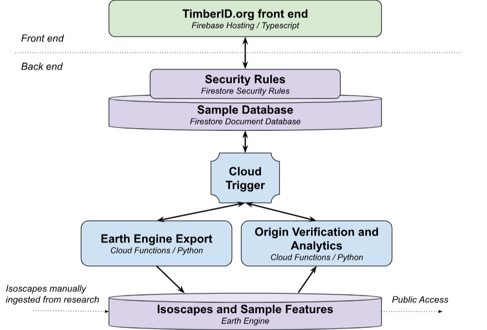

# 🛠 High Level Design

TimberID has several high level components:

1. A UI is used to track and store both reference and untrusted samples (The Timber ID frontend)
2. An ML model uses reference samples to create a ground truth isoscape (ML Isoscape Model)
3. A backend processes analytics against samples to perform origin verification that is reported through the UI (Insights and Analytics)

<figure><figcaption>
Component diagram for TimberID
</figcaption></figure>

Unlike a traditional three tier architecture, a simplified Backend-as-a-Service architecture is leveraged that encodes security rules in a declarative manner directly on the database. This approach reduces amount of code by eliminating the traditional middle tier layer that performs authorization and domain specific logic.

This  allows a clean separation between front and back end where the front end solely interacts directly with the Firestore database. Most operations can then be made securely, directly from the front end relying on the Firstore Security Rules to safeguard data.

The new model of Backend-as-a-Service does not completely get rid of back end code. In cases where complex offline, asynchronous code or sensitive logic (such as fraud verification) must be run, the typical approach is to connect cloud functions directly to the shared database. Both sides (front end and back end) then listen on state changes to the database, each making changes based on user input (in the case of the front end) or the back end (in the case of complex calculations completing).

The below high level diagram summarizes our approach.

<figure><figcaption></figcaption></figure>

\
