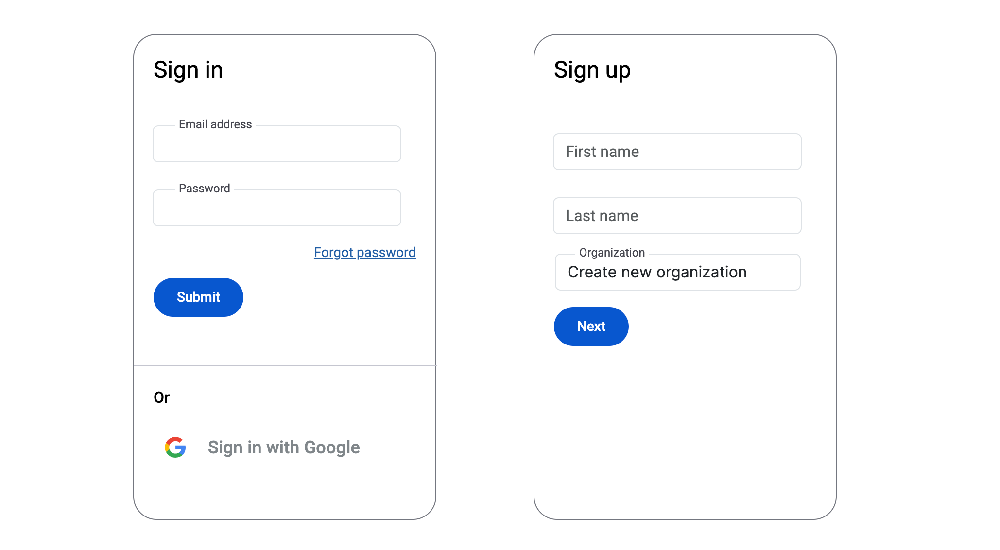
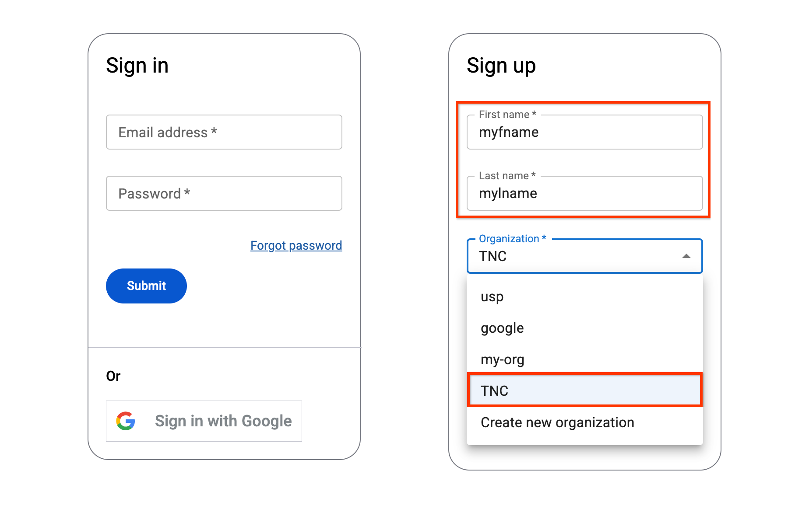
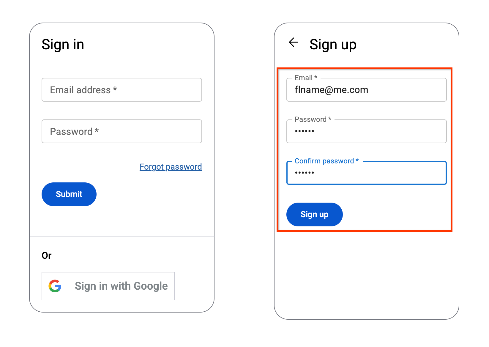
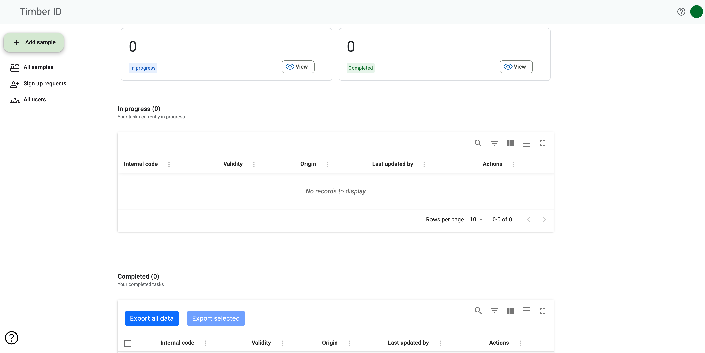
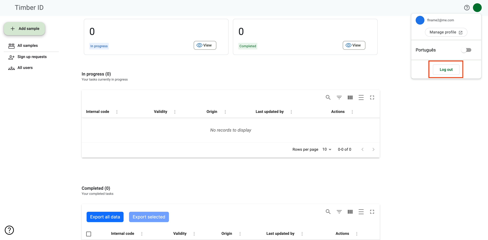
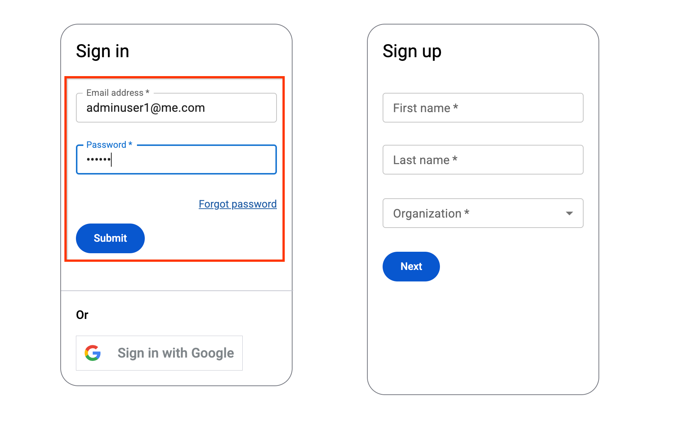
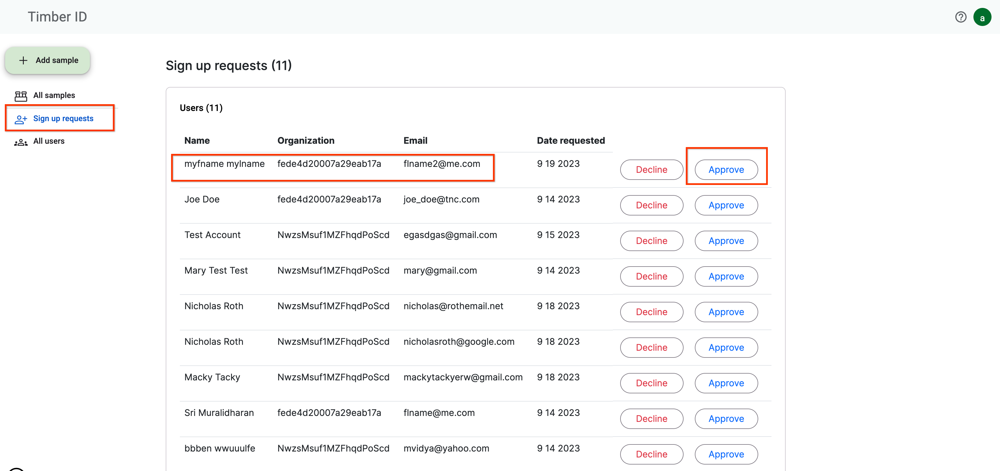
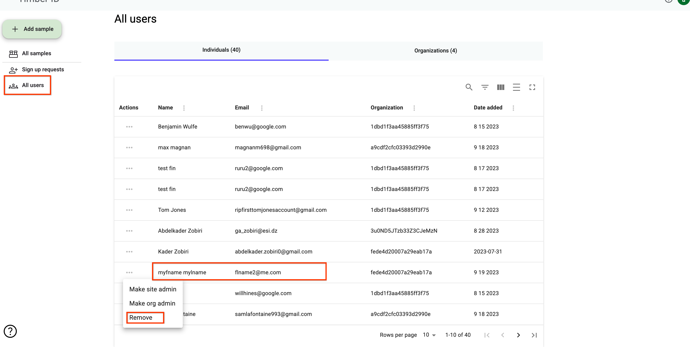

# 🚀 Test Procedure for Production Release

## General Functionality Test Plan

### New User Registration

1. Access TimberID [timberid.org](http://timberid.org)
2. Navigate to the sign-in/sign-up page:

<figure><figcaption></figcaption></figure>

3. Under sign up, enter in a new FirstName 'myfname' and LastName 'mylname' and choose the 'TNC' organization:

<figure><figcaption></figcaption></figure>

4. Click Next
5. Enter the email 'flname2@me.com' and password '123123' with a confirmation password '123123':

<figure><figcaption></figcaption></figure>

6. Click "Signup"
7.  Empty sample page is shown. Expecting zero samples to show:\

    <figure><figcaption></figcaption></figure>
8. Log out

<figure><figcaption></figcaption></figure>

9. Log in as adminuser1@me.com '123123' as password:

<figure><figcaption></figcaption></figure>

10. Navigate to the Sign up requests screen
11. Approve the user flname into the 'TNC' organization by clicking the 'Approve' button&#x20;

<figure><figcaption></figcaption></figure>

12. Log out and log in again as flname2@me.com with password '123123' Click signIn
13. Samples List page shows with all current debug samples (screenshot)
14. Log out
15. Log in again as adminuser1 per step 7
16. Navigate to the All users screen and delete flname@me.com by clicking Remove&#x20;

<figure><figcaption></figcaption></figure>

17. Log out. Log in as flname2@me.com with password 123123
18. Verify that no samples are shown.
19. Click onthe profile icon and view profile 20 unregister from timberid.

\

\
\

\
\

\
\

\
