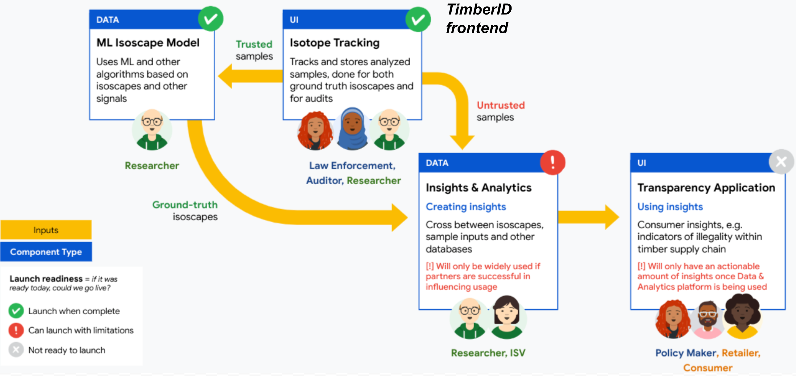

# ✨ Mission and Goals

## <mark style="color:blue;">Increase timber supply chain transparency</mark> in the <mark style="color:green;">Brazilian Amazon</mark> using <mark style="color:yellow;">data-driven insights</mark> to <mark style="color:red;">support rain-forest preservation</mark>

## **Components**

TimberID has three high level components:

1. A Web UI is used to track and store both reference and untrusted samples (Isotope Tracking frontend)
2. A Variational Inference tensorflow ML model that uses timber reference samples to create a ground truth isoscape (ML Isoscape Model)
3. A backend analytics engine that runs on seized timber to perform origin verification and other analysis (Insights and Analytics)

<figure><figcaption>
Component diagram for TimberID
</figcaption></figure>

The fourth component shown above, the Transparency Application is a future application under the Digitais da Floresta platform that uses the generated insights from TimberID (along with other insights) to create actional insights for target users.
