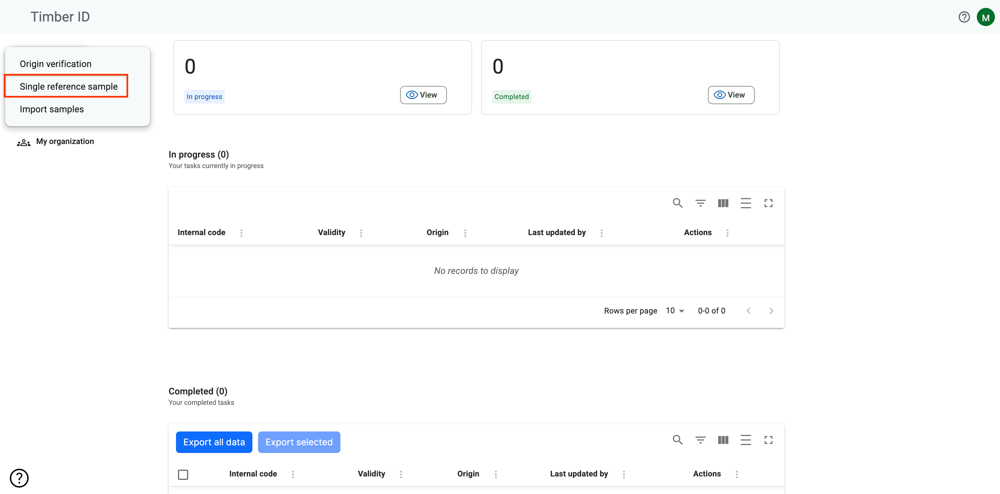
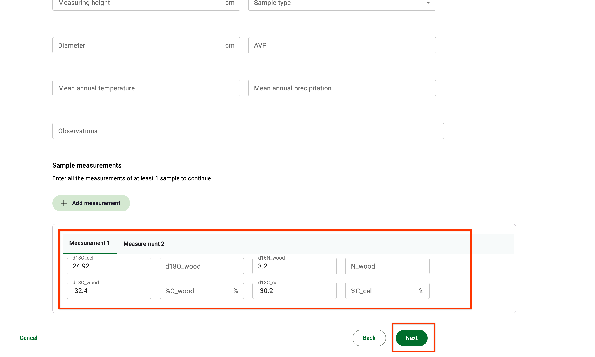

# 🪵 Single Reference Sample + Import

### What are Reference Samples?

TimberID allows you to add reference Timber Samples to your database. Reference Timber Samples are those collected by researchers or related entities whose measurements are used to train models.&#x20;

TimberID uses Reference Timber Samples to train a Variational Inference ML model that predicts isotope ratios for several elements (dO18, dC13, dN15).

How do I enter a Reference Sample?

There are two options for adding sample data.

1.  You may use the option "Single Reference Sample" under  "Add Sample".\

    <figure><figcaption></figcaption></figure>

    Single Reference Sample allows you to enter data about one timber sample, including all measurements that may exist at different points on the disc or slice of timber.\

2. You may also use the option "Import Samples" right below "Single Reference Sample"\
   Import Samples allows you to import multiple Samples from a CSV file.

### Adding a Single Reference Sample

<figure><figcaption></figcaption></figure>

If you enter a Reference Sample with the TimberID UI, it will record the following items on the first screen:

<table><thead><tr><th width="196">Field</th><th width="135.33333333333331">Required</th><th>What to enter</th></tr></thead><tbody><tr><td>Sample Name</td><td>Required</td><td>Any text that names the sample. TimberID assigns a unique ID independently from this field.</td></tr><tr><td>Status</td><td>Required</td><td>"Completed" if all measurements have been taken. May also be "in transit", "in progress" or "not started" to indicate various progress within a lab. Only "Completed" samples are exported to Earth Engine for research.</td></tr><tr><td>Tree Species</td><td></td><td>The scientific species name of the timber. Please select an entry from the drop-list.</td></tr><tr><td>Origin</td><td></td><td>Should always be "Known" for Reference Samples.</td></tr><tr><td>Collection Site</td><td>Required</td><td>The name of the collection site which may be identical to Municipality (if only one site exists in a Municipality). Can be any text.</td></tr><tr><td>Latitude/Longitude</td><td>Required</td><td>The latitude and longitude representing a location within Brazil that identifies where the tree was harvested for the timber sample.</td></tr><tr><td>State</td><td></td><td>The state in which the latitude/longitude exists.</td></tr><tr><td>Municipality</td><td></td><td>The municipality in which the latitude/longitude exists.</td></tr><tr><td>Date Collected</td><td></td><td>For Reference Samples, the date the sample was harvested from a live tree.</td></tr><tr><td>Collected By</td><td>Required</td><td>Whether this timber sample was collected by a third party or the organization itself</td></tr><tr><td>City</td><td></td><td>The city in which the 3rd party collected the sample.</td></tr></tbody></table>

After hitting Next, the following screen appears with additional optional measurements to be recorded:

<figure><figcaption></figcaption></figure>

<table><thead><tr><th width="251.33333333333331">Field</th><th>What to enter</th></tr></thead><tbody><tr><td>Measuring height</td><td>The height in cm off the forest floor where the sample was taken.</td></tr><tr><td>Sample type</td><td>One of "Disc", "Triangular", "Chunk" or "Fiber" to indicate the shape or characteristic of the timber.</td></tr><tr><td>Diameter</td><td>The diameter in cm of the sample.</td></tr><tr><td>AVP</td><td></td></tr><tr><td>Mean Annual Temperature</td><td></td></tr><tr><td>Mean Annual Precipiation</td><td></td></tr><tr><td>Observations</td><td>Free text that indicates any observations or notes about the sample.</td></tr><tr><td>Measurements</td><td>Isotope measurements as recorded by a mass spectrometer.</td></tr><tr><td>  dO18_cel</td><td>delta O18 from cellulose</td></tr><tr><td>  dO18_wood</td><td>delta O18 from wood</td></tr><tr><td>  dN15_wood</td><td>delta N15 from wood</td></tr><tr><td>  N_wood</td><td>N from wood</td></tr><tr><td>  d13C_wood</td><td>delta C13 from wood</td></tr><tr><td>  d13C_cel</td><td>delta C13 from cellulose</td></tr><tr><td>  %C_wood/%C_cel</td><td>the percentage of carbon in wood or cellulose.</td></tr></tbody></table>

Click on the Next button and the final page allows you to review what you have entered. Click "Create Sample" to add the sample to TimberID as below.

<figure><figcaption></figcaption></figure>

### Importing Sample from a CSV file

